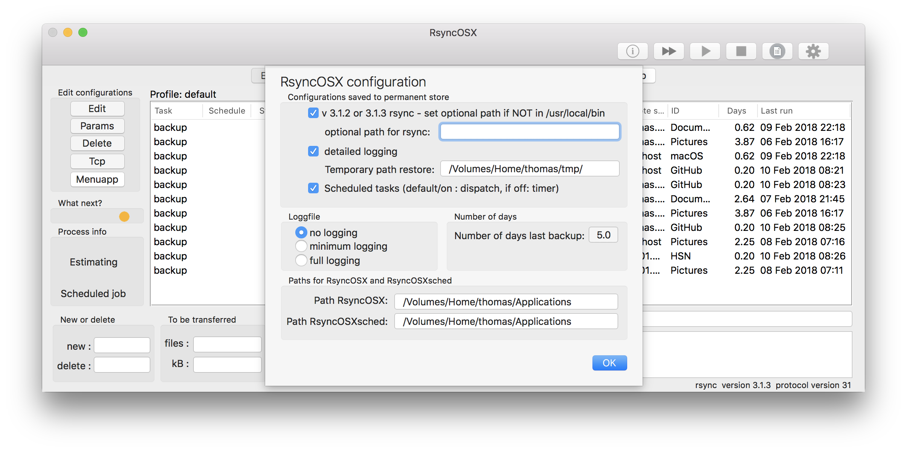
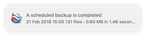
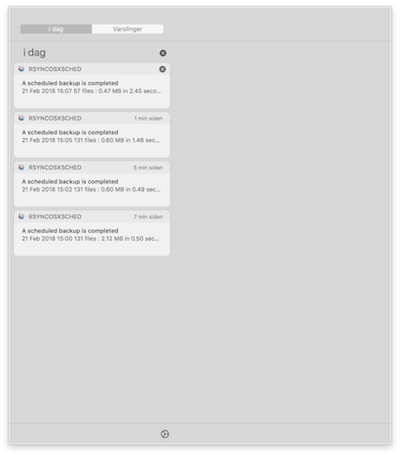
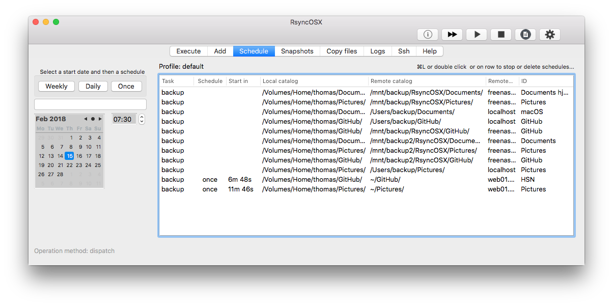
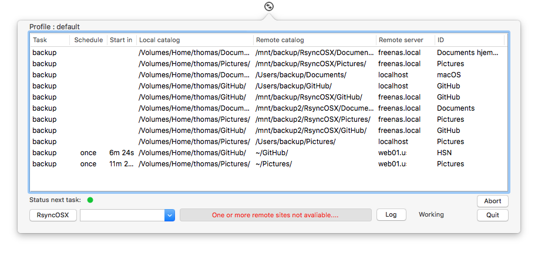
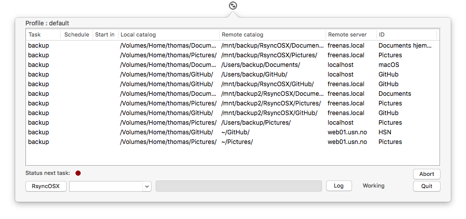
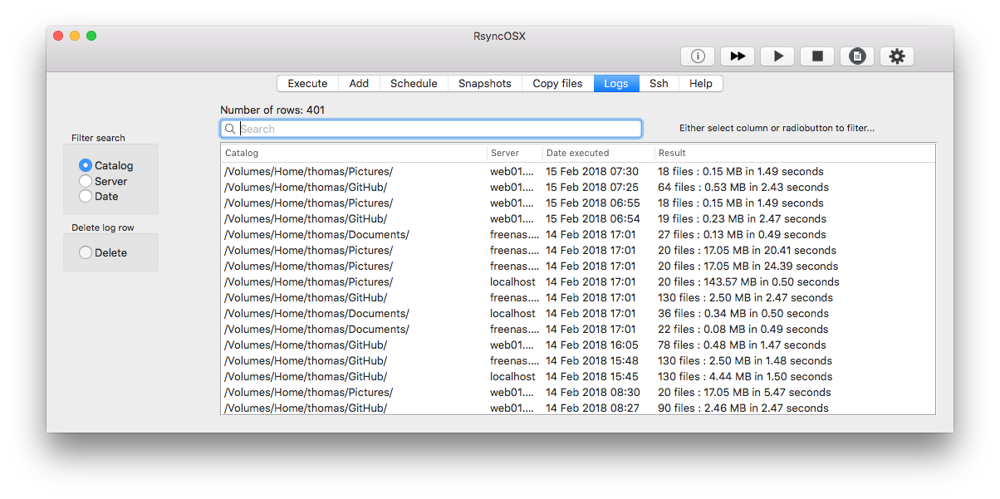
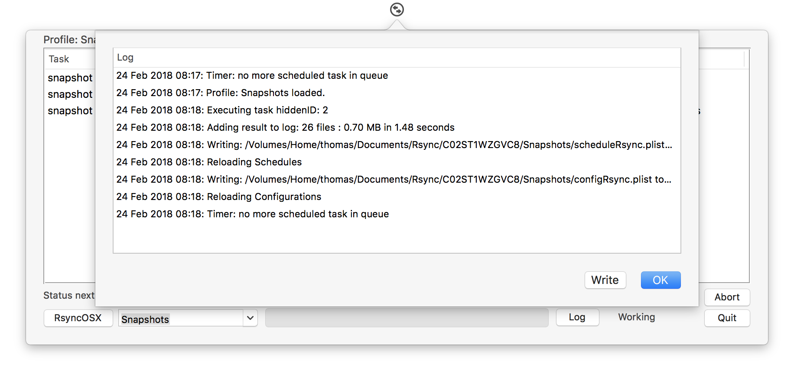
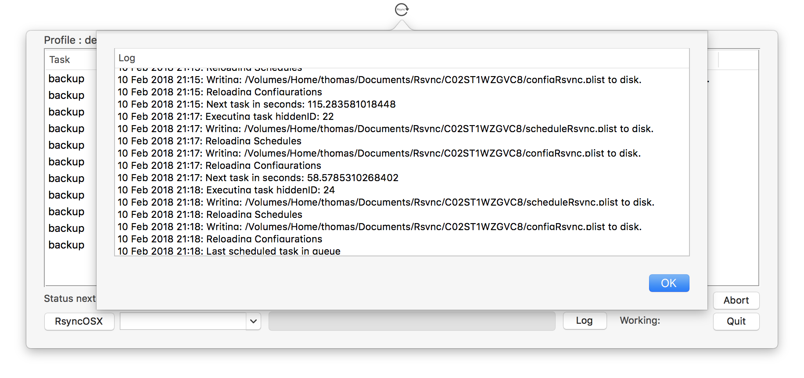

## RsyncOSXsched

Updated 22 Feb 2018: The app is [released](https://github.com/rsyncOSX/RsyncOSX/releases) as release candidate together with RsyncOSX. This is probably the last release candidate before release in beginning of March.

This is the menu app (popover) for executing scheduled tasks RsyncOSX. The idea is to add scheduled tasks in RsyncOSX, quit RsyncOSX and let the menu app take care of executing the scheduled tasks.

Only scheduled tasks from the selected profile is active. In the release candidate there is an option (default on) to execute scheduled tasks within the menu app only. **Do not** run both RsyncOSX and the menu app at the same time **utilizing the same profile** if this option is switched **off**. Any scheduled tasks will be executed at the same time in both apps and it will most likely cause problems. Default is execute scheduled tasks only in menu app.

The menu app can be started from RsyncOSX and RsyncOSX can be activated from the menu app. This require paths for both apps to be entered into userconfiguration.  The paths are used for activating the apps from either within RsyncOSX or RsyncOSXsched. Toggle on/off if scheduled tasks in menu app only. Default is in menu app only.

A notification is submitted when a scheduled tasks is completed.

Adding scheduled for tasks in RsyncOSX. After adding tasks either keep RsyncOSX running or select main menu and select the menuapp button. If you decide to let RsyncOSX execute the scheduled tasks remember to set the correct settings in user configuration.

Double click on row brings up details about schedules and logs for one task.

The green bullet in column `Schedule` indicates two scheduled tasks within next hour (green lights). Selecting the `Menuapp` in main view quits RsyncOSX and starts the menu application. The default profile is selected when it starts.

The status light is green indicates there are active tasks waiting for execution.

The scheduled tasks are completed.

### Logging

There is a minimal logging in menu app. The log is not saved to disk, it lives only during lifetime of menu app. The menu app logs the major actions within the menu app.

