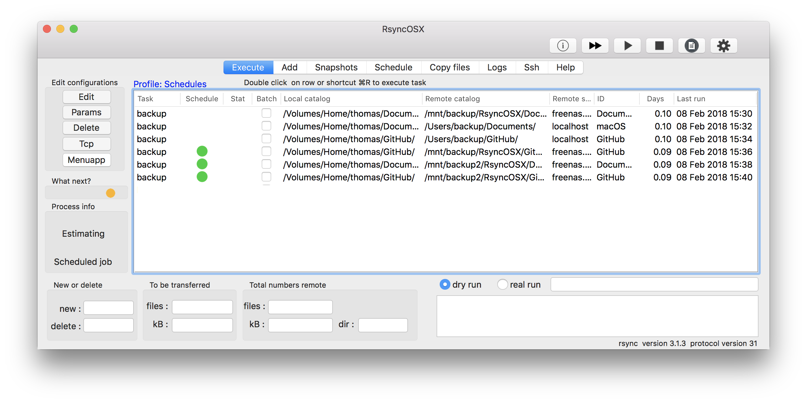

## RsyncOSXsched

**Important:** There are some issues regarding how to enter `daily` and `weekly` schedules.  There will be a minor redesign of the schedule part. The changes for all schedules will be to enter a start and type of schedule. The schedule will be active until stopped. This applies to schedules `daily` and `weekly`. Schedule `once` executes once, that is it. The updated release candidate is includes revised schedule.

Initial listing v0.0.1, it compiles and executes but still need some more testing before released. This is the menu app (popover) for executing scheduled tasks RsyncOSX. The idea is add scheduled tasks in RsyncOSX, quit RsyncOSX and let the menu app take care of executing the scheduled tasks.

**Important**: only scheduled tasks from the selected profile is active. **Do not** run both RsyncOSX and the menu app at the same time **utilizing the same profile**. Any scheduled tasks will be executed at the same time in both apps and it will most likely cause problems.

The menu app can be started from RsyncOSX and RsyncOSX from the menu app. This require paths for both apps to be entered into userconfiguration (**without** a trailing `/`).  The paths are used for activating the apps from either within RsyncOSX or RsyncOSXsched.

Adding scheduled for tasks (in profile `Snapshots`) in RsyncOSX. After adding tasks either keep RsyncOSX running or select main menu and select the button `Menuapp`. The green and yellow lights in column `Schedule` indicates two scheduled tasks within next hour (green lights) and one more than one hour (yellow light).

Double click on row brings up details about schedules and logs for one task.

Selecting the `Menuapp` in main view quits RsyncOSX and starts the menu application. The default profile is selected when it starts. There are no active schedules in the `default` profile. Selecting profile `Snapshots` (the menu app reads any profile created within RsyncOSX) activates any scheduled tasks in profile. Only scheduled tasks in selected profile is activated.

The status light is green indicating there is an active task waiting for execution. In the example there was only schedules of type `once`. After all three was executed there were not any scheduled tasks waiting.

Opening RsyncOSX and checking the logs for result of executed tasks.
