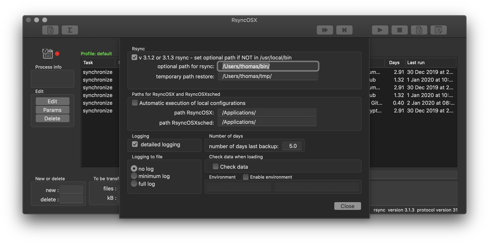
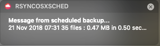
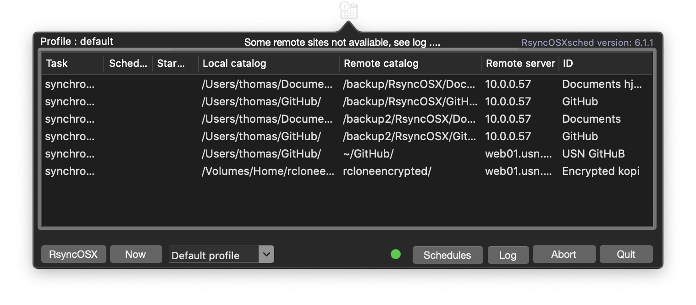
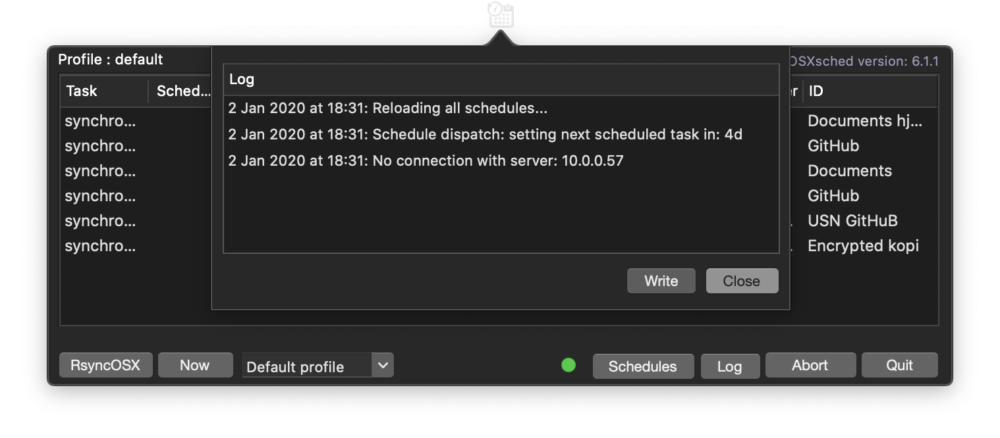
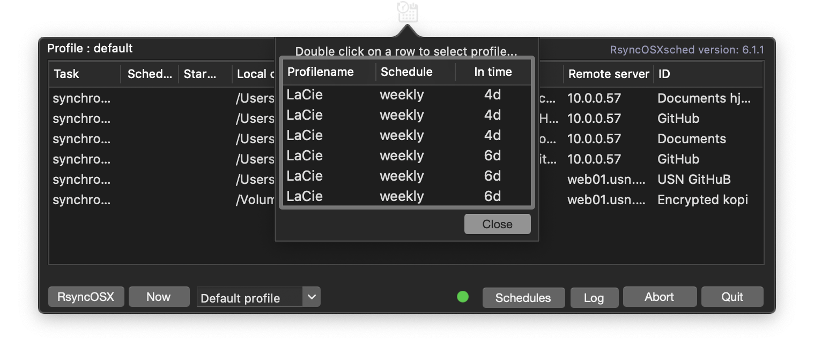
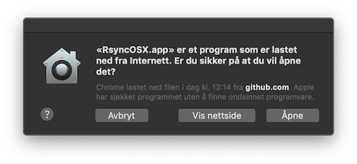

## RsyncOSXsched


This repository is updated for Xcode 10.2 and Swift 5. Both are still in beta and yet not released by Apple. The branch "v5.6.2.-fixes" is for updating fixes to the released version of RsyncOSXsched if the upcoming release of Xcode 10.2 and Swift 5 takes some time.

This is the `menu app` (RsyncOSXsched.app) for executing scheduled tasks in RsyncOSX. Scheduled tasks are added in RsyncOSX. Quit RsyncOSX and let the menu app take care of executing the scheduled tasks. RsyncOSX does **not** execute scheduled tasks. Scheduled tasks are only added and deleted in RsyncOSX.

The `menu app` can be started from RsyncOSX. This require paths for both apps to be entered into userconfiguration.  The paths are used for activating the apps from either within RsyncOSX or RsyncOSXsched.

.

The `menu app` submit a notification when a scheduled tasks is completed. A scheduled task is either of type `once`, `daily` or `weekly`.



If there are tasks waiting for executing the status light is green.



There is a minimal logging in the menu app. The menu app logs the major actions within the menu app.



Active scheduled tasks.



### Application icon

The application icon for `RsyncOSXsched.app` (not the `menu app` icon) is created by [Zsolt Sándor](https://github.com/graphis). All rights reserved to Zsolt Sándor.

### Signing and notarizing

The app is signed with my Apple ID developer certificate and [notarized](https://support.apple.com/en-us/HT202491) by Apple. If you have Xcode developer tools installed executing the following command `xcrun stapler validate no.blogspot.RsyncOSXsched RsyncOSXsched.app` will verify the RsyncOSX.app.
```
xcrun stapler validate no.blogspot.RsyncOSXsched RsyncOSXsched.app
Processing: /Volumes/Home/thomas/GitHub/RsyncOSXsched/Build/Products/Release/RsyncOSXsched.app
The validate action worked!
```
This is the message when opening a downloaded version.



The message is in Norwegian: "Apple har sjekket programmet uten å finne ondsinnet programvare.". The english version of it is: "Apple checked it for malicious software and none was detected.".

#### SwiftLint

I am using [SwiftLint](https://github.com/realm/SwiftLint) as tool for writing more readable code. I am also using Paul Taykalo´s [swift-scripts](https://github.com/PaulTaykalo/swift-scripts) to find and delete not used code.

### Compile

To compile the code, install Xcode and open the RsyncOSXsched project file. Before compiling, open in Xcode the `RsyncOSXsched/General` preference page (after opening the RsyncOSXsched project file) and replace your own credentials in `Signing`, or disable Signing.

There are two ways to compile, either utilize `make` or compile by Xcode. `make release` will compile the `RsyncOSXsched.app` and `make dmg` will make a dmg file to be released.  The build of dmg files are by utilizing [andreyvit](https://github.com/andreyvit/create-dmg) script for creating dmg and [syncthing-macos](https://github.com/syncthing/syncthing-macos) setup.
