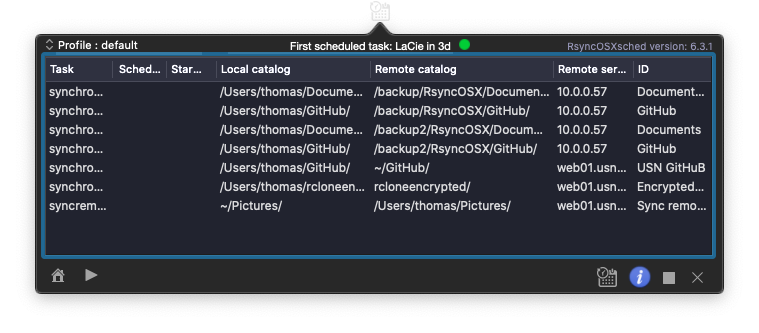

## RsyncOSXsched

This is the `menu app` (RsyncOSXsched.app) for executing scheduled tasks in RsyncOSX. Scheduled tasks are added in RsyncOSX. Quit RsyncOSX and let the menu app take care of executing the scheduled tasks. RsyncOSX does **not** execute scheduled tasks. Scheduled tasks are only added and deleted in RsyncOSX.

The `menu app` can be started from RsyncOSX. This require paths for both apps to be [entered into userconfiguration](https://rsyncosx.github.io/UserConfiguration).

### Localization

[RsyncOSX speaks new languages](https://rsyncosx.github.io/Localization). RsyncOSXsched is localized to:
- German - by [Andre](https://github.com/andre68723)
- French - translated by [crowdin](https://crowdin.com/project/rsyncosx)
- Norwegian - by me
- English - by me and the base language of RsyncOSXsched
- Italian - by [Stefano Steve Cutelle'](https://github.com/stefanocutelle)
  - Italian localization is released in version 6.2.5 release candidate

Localization is done by utilizing [Crowdin](https://crowdin.com/project/rsyncosx) to translate the xliff files which are imported into Xcode after translating. Xcode then creates the required language strings. [Crowdin is free for open source projects](https://crowdin.com/page/open-source-project-setup-request).

### Screenshots

The menu app is a simple app with a few screens. The one and only task for the menu app is to execute scheduled RsyncOSX tasks. Every time a task is executed a notification is submitted.

If there are tasks waiting for executing the status light is green.

There is a minimal logging in the menu app. The menu app logs the major actions within the menu app.

Active scheduled tasks.

### Signing and notarizing

The app is signed with my Apple ID developer certificate and [notarized](https://support.apple.com/en-us/HT202491) by Apple. See [signing and notarizing](https://rsyncosx.github.io/Notarized) for info.

### SwiftLint and SwiftFormat

I am using [SwiftLint](https://github.com/realm/SwiftLint) as tool for writing more readable code. I am also using Paul Taykalo´s [swift-scripts](https://github.com/PaulTaykalo/swift-scripts) to find and delete not used code. Another tool is [SwiftFormat](https://github.com/nicklockwood/SwiftFormat) for formatting swift code.

### Compile

To compile the code, install Xcode and open the RsyncOSXsched project file. Before compiling, open in Xcode the `RsyncOSXsched/General` preference page (after opening the RsyncOSXsched project file) and replace your own credentials in `Signing`, or disable Signing.

There are two ways to compile, either utilize `make` or compile by Xcode. `make release` will compile the `RsyncOSXsched.app` and `make dmg` will make a dmg file to be released.  The build of dmg files are by utilizing [andreyvit](https://github.com/andreyvit/create-dmg) script for creating dmg and [syncthing-macos](https://github.com/syncthing/syncthing-macos) setup.
