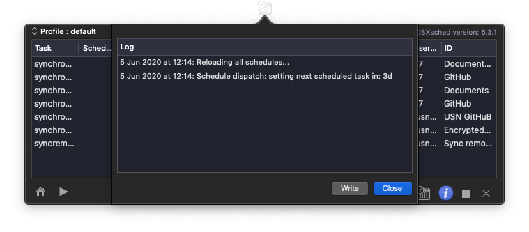

## RsyncOSXsched

This is the `menu app` (RsyncOSXsched.app). The menu app is a helper application for executing scheduled tasks in RsyncOSX. Scheduled tasks are added in RsyncOSX. Quit RsyncOSX and let the menu app take care of executing the scheduled tasks. RsyncOSX does **not** execute scheduled tasks. Scheduled tasks are only added and deleted in RsyncOSX. The `menu app` is started from RsyncOSX.

### Localization

RsyncOSXsched is localized to:

- Chinese (Simplified) -  by [StringKe (Chen)](https://github.com/StringKe)
- German - by [Andre Voigtmann](https://github.com/andre68723)
- Norwegian - by me
- English - the base language of RsyncOSX
- Italian - by [Stefano Steve Cutelle'](https://github.com/stefanocutelle)
- Dutch - by [Marcellino Santoso](https://github.com/maebs), in progress

### Screenshots

The menu app is a simple app with a few screens. The one and only task for the menu app is to execute scheduled RsyncOSX tasks. Every time a task is executed a notification is submitted.

If there are tasks waiting for executing the status light is green.

There is a minimal logging in the menu app. The menu app logs the major actions within the menu app.

Active scheduled tasks.

