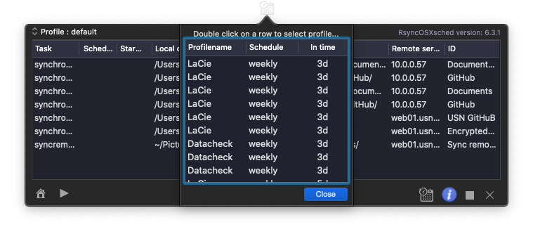

## RsyncOSXsched

This is the `menu app` (RsyncOSXsched.app). The menu app is an helper application for executing scheduled tasks in RsyncOSX. Scheduled tasks are added in RsyncOSX. Quit RsyncOSX and let the menu app take care of executing the scheduled tasks. RsyncOSX does **not** execute scheduled tasks. Scheduled tasks are only added and deleted in RsyncOSX. The `menu app` is started from RsyncOSX.

### Localization

[RsyncOSX speaks new languages](https://rsyncosx.netlify.app/post/localization/). RsyncOSXsched is localized to:
- German - by [Andre](https://github.com/andre68723)
- French - translated by [crowdin](https://crowdin.com/project/rsyncosx)
- Norwegian - by me
- English - by me and the base language of RsyncOSXsched
- Italian - by [Stefano Steve Cutelle'](https://github.com/stefanocutelle)
  - Italian localization is released in version 6.2.5 release candidate

### Screenshots

The menu app is a simple app with a few screens. The one and only task for the menu app is to execute scheduled RsyncOSX tasks. Every time a task is executed a notification is submitted.

If there are tasks waiting for executing the status light is green.

There is a minimal logging in the menu app. The menu app logs the major actions within the menu app.

Active scheduled tasks.

